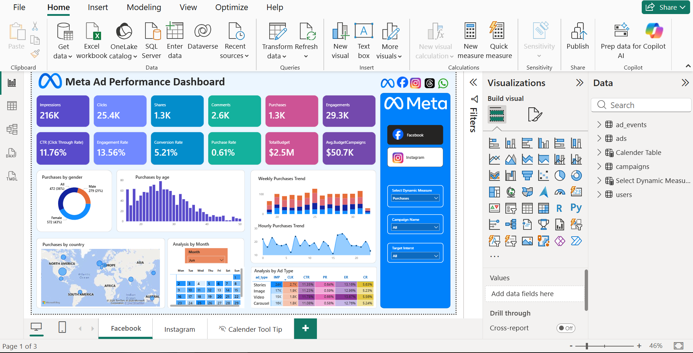
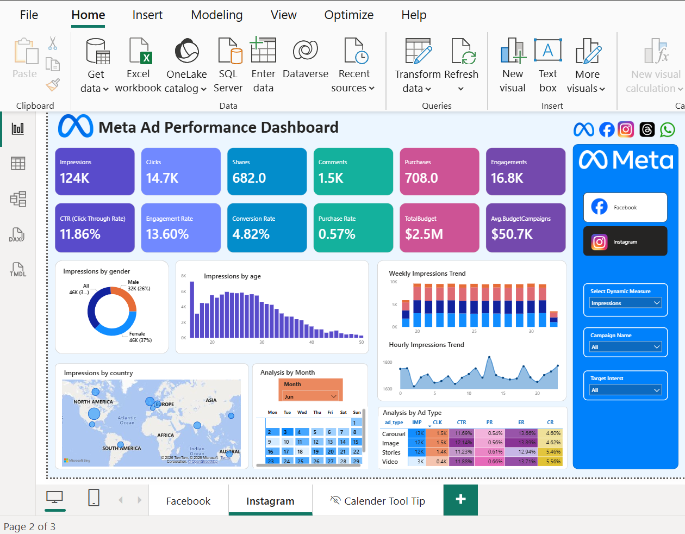

# 📊 Meta Ad Performance Analysis Dashboard

## 🚀 Project Overview

This Power BI project analyzes Facebook and Instagram ad campaign performance including engagement, conversions, audience behavior, and budget utilization.

---

## 🎯 Business Objective

- Identify best performing ad formats
- Analyze audience engagement patterns
- Track conversions and CTR
- Optimize marketing budget allocation

---

## 🛠️ Tools Used

- Power BI
- Power Query
- DAX
- Data Modeling

---

## 📂 Data Model

- Fact Table: Ad Events  
- Dimension Tables: Ads, Campaigns, Users  

---

## 📈 KPIs

- Impressions
- Clicks
- CTR
- Engagement Rate
- Conversion Rate
- Purchases

---

## 🔍 Key Insights

- Video ads performed best
- Age group 18–30 is most active
- India & US are top regions
- Evening hours show peak engagement

---

## 📸 Dashboard Preview

### Facebook Dashboard

### Instagram Dashboard

---

## 👤 Author

Veena R  
Aspiring Data Analyst | Power BI Developer

